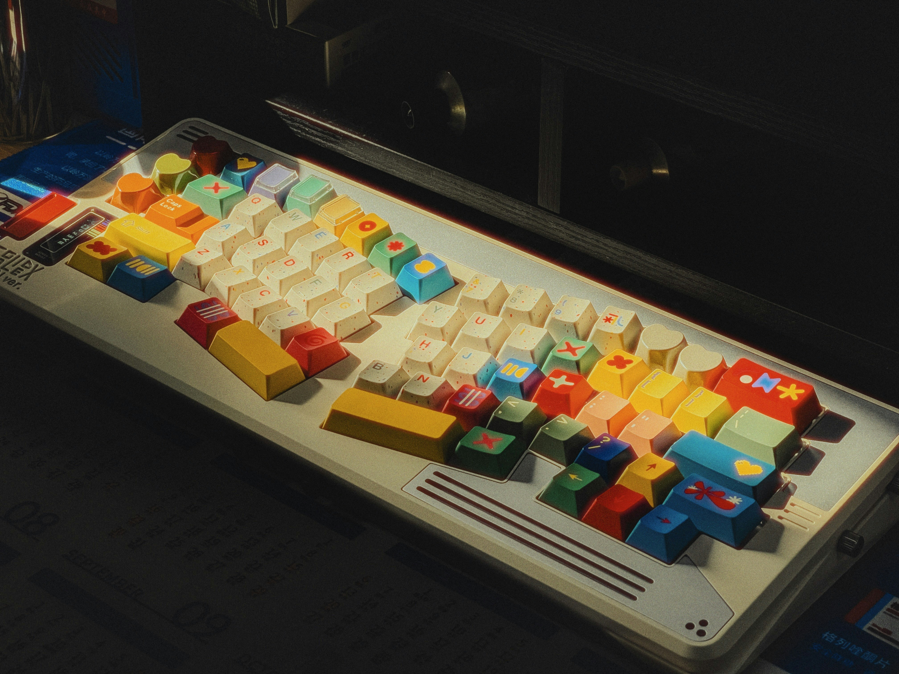

<!DOCTYPE html>
<html class="scroll-smooth" lang="pt-br">

<head>
  
  <meta charset="UTF-8">
  
  

  
  <meta name="viewport" content="width=device-width, initial-scale=1.0">
  <title>DeniDev</title>
</head>

<body class="bg-escura text-clara font-sans p-4">

   <!-- brilhante -->
  

  

  
  <!-- navegaçao -->
  <nav class="flex fixed top-0 left-0 right-0 bg-vidro backdrop-('rgba(15, 23, 42, 0.5)') py-2 text-clara  text-lg font-bold  items-center rounded-lg shadow-lg z-9999 ">
    <!-- menu -->
    

      <!-- menu-link -->
      <ul class="flex  relative p-1 font-medium space-x-12">
        <li class="underline-hover"> <a href="#inicio">Início</a></li>
        <li class="underline-hover"><a href="#sobre">Sobre</a></li>
        <li class="underline-hover"><a href="#projetos">Projetos</a></li>
        <li class="underline-hover"><a href="#contato">Contato</a></li>
      </ul>
    

  </nav>
  <!-- cabeçalho -->
  <main class=" flex min-h-screen   flex-col items-center justify-center" id="inicio">
    <!-- foto perfil -->
    
    <h1 class="text-4xl font-bold on-underline text-primaria m-3 ">Edenilton Andrade</h1>
    
Desenvolverdor Front End

  </main>

  <!-- sobre -->
  <section class="py-12 px-8" id="sobre">
    <!-- sobre titulo -->
    <h2 class="text-5xl text-claro mb-2 text-center font-bold on-underline">Sobre Mim</h2>
    <!--  -->
    <!-- sobre-caixa -->
    

      <!-- sobre-paragrafo -->
      
Tô só começando, mas com fome de código e sede de aprender.

    

  </section>

  <!-- projetos -->

  <section id="projetos" class="projetos  py-23 px-8 ">

    <!-- projetos titulo  -->
    <h2 class="text-5xl font-bold on-underline mb-12 text-center
    "> Meu Projetos</h2>

    

      <!-- projetos card -->
      

        <!-- projeto imagem -->
        
        

          <h3 class="text-2xl font-bold 
            on-underline  mb-1"> AgenciaDeEmprego</h3>
          <!--paragrafo projetos -->
          
Lorem ipsum dolor, sit amet consectetur adipisicing elit. Eveniet veniam ratione minus accusantium ipsam blanditiis?

        

        <!-- infor projetos -->

      

      

        <!-- projeto imagem -->
        
        <!-- infor projetos -->
        

          <h3 class="text-2xl font-bold 
            on-underline  mb-1"> AluguelBike</h3>
          <!--paragrafo projetos -->
          
Lorem ipsum dolor, sit amet consectetur adipisicing elit. Eveniet veniam ratione minus accusantium ipsam blanditiis?

        

      

      

        <!-- projeto imagem -->
        
        

          <!-- infor projetos -->
          <h3 class="text-2xl font-bold 
              on-underline mb-1"> lanHouse</h3>
          <!--paragrafo projetos -->
          
Lorem ipsum dolor, sit amet consectetur adipisicing elit. Eveniet veniam ratione minus accusantium ipsam blanditiis?

        

      

    

  </section>
  <section id="contato" class="py-12 px-8">
    <!-- contato titulo -->
    <h2 class="text-5xl font-bold on-underline mb-12 text-center">Contato</h2>
    <!--  -->
    <form class="formulario-contato bg-[rgba(255, 255, 255, 0.05)] mb-6 backdrop-blur-sm rounded-lg shadow-lg p-4 border-2 border-vidro overflow-hidden max-w-[600px] mx-auto" action="https://
          " id="formulario">

      

        <form
        id="formulario"
        onsubmit="enviarWhatsap(event)"
        class="formulario-contato bg-[rgba(255, 255, 255, 0.05)] mb-6 backdrop-blur-sm rounded-lg shadow-lg p-4 border-2 border-vidro overflow-hidden max-w-[600px] mx-auto"
      >
        

          <input
            placeholder="Nome"
            class="campo-nome w-full h-12 p-2 border border-vidro rounded mb-2 bg-vidro outline-none 
            focus:border-primaria focus:ring-primaria focus:outline-none focus:ring-2"
            type="text"
            id="nome"
            required
          />
        

      
        

          <textarea
            id="mensagem"
            placeholder="Digite sua mensagem"
            class="w-full h-32 p-2 border border-vidro rounded-lg bg-vidro 
            text-clara mb-2 resize-none focus:border-primaria focus:ring-primaria 
            focus:outline-none focus:ring-2"
            name="mensagem"
            rows="4"
            required
          ></textarea>
        

      
        <button
          type="submit"
          class="botao-form text-clara bg-[linear-gradient(45deg,_#4f46e5,_#7c3aed)] py-4 px-8
          border-none rounded-lg cursor-pointer font-bold w-full transition-all duration-500 ease-in-out 
          hover:-translate-y-1 hover:scale-[1.01] transform"
        >
          Enviar
        </button>
      </form>
      
      

  </section>

</html>